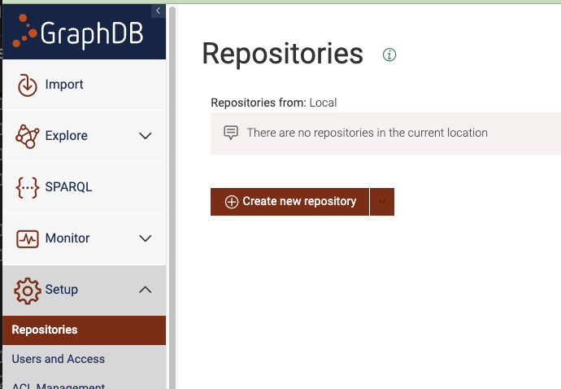

This folder holds programs to generate intent report content in knowledge graphs. The programs will simulate how underlying resources reports back on received intents. It is part of the experimentation related to lifecycle management of intents. Intent reports are the result of ReportExpectations expressed in intents that are formed according to the TM Forum intent ontology.

It is recomended to create a python environment to isolate the needed library imports from your standard python environment. This can be done like this:
```
# Create the environment
python -m venv lifecycle_python_env
# Activate the environment
source lifecycle_python_env/bin/activate
# Install the needed libraries
# Install the needed libraries, note that the requirements.txt file was created like this:
# pip list --not-required --format=freeze > requirements.txt
pip install -r requirements.txt
```

**intent_report_slice_latency.py:**
The program creates latency measurements below 10ms with a 2% chance of values above 10ms with 10 seconds between measurements.  

This program takes one mandatory parameter called REPOSITORY, which should be the URL of the repository to insert into (e.g. -r http://Arnes-MacBook-Pro.local:7200/repositories/Slice1LatencyMeasurements). When only the mandatory parameter is present, the program will sleep 10 seconds between inserting new reports.

The program can also take an additional optional parameter NUMBEROFREPORTS. When this optional parameter is present the program will generate all the reports as fast as possible with timestamps 10 seconds apart from current time (e.g. -r http://Arnes-MacBook-Pro.local:7200/repositories/Slice1LatencyMeasurements) -n 10000). Note that when using this optional parameter, nothing will be printed to the terminal (unless something fails).

The program inserts the latency measurements in GraphDB and we created a new repository in GraphDB like this:




