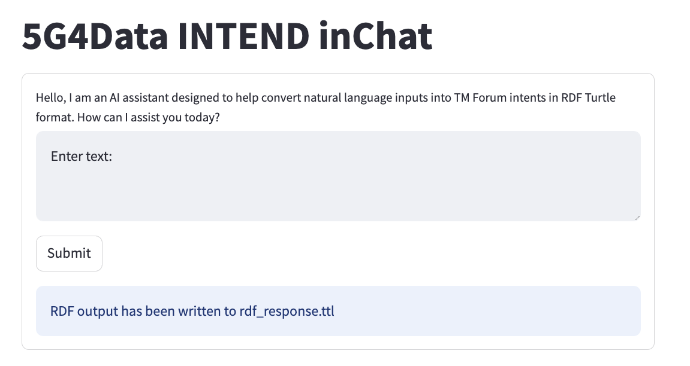

# Intent-Lifecycle-Management inChat experiments
This folder contains a very simplistic PoC for the first step of the lifecycle management of intents. In the INTEND architecture, this step will be handled by inChat. The main goal in this step is to transform a natural language expressed statement from a customer to a formal TM Forum formatted Intent description (following v.3.6.0 of the TM Forum Intent ontology). Generated intents could be stored in a triple store (like GraphDB), and additional information related to state changes (lifecycle) of intents could also be stored in a triple store.

The PoC is realized as an LLM agent using the [LangChain](https://python.langchain.com/docs/introduction) agent framework. Later versions will probably use the [LangGraph](https://www.langchain.com/langgraph) framework. Note that there are many llm agent frameworks out there, and new ones are added on a regular basis. It could be that other existing or future frameworks will fit the needs of the INTEND project better.

The general idea for this PoC has been to test different aproaches to make the agent generate valid TM Forum formatted intent descriptions. It is important to understand that, for the 5G4Data use-case, it is a very limited set of Intent descriptions that can be fulfilled and thus created. It is the capabilities of the underlying infrastructure that limits the set of possible intents. For the 5G4Data use-case the underlying infrastructure constitutes:
 - A 5G cellular network with a Standalone 5G core
 - Edge compute datacenters - Kubernetes clusters

The Expectations that can be expressed is therefore limited to 5G network and Edge compute configurations. For the 5G network this is limited to setting up virtual networks with specific QoS requirements (e.g. a 5G network slice or a 5G PDU session). For the Edge Compute this is limited to being able to deploy 3rd party workloads to one of the many edge datacenters (they are envisioned to be spread out geograpically in the CSP footprint). It is also possible that the compute can offer other capabilities, for example: power consumption constraints, compute latency constraints, etc.

In general, the idea going forward will be to isolate the use-case specific parts. The use-case specific parts could for example be: system prompts, few shot examples, bringing in use-case specific knowledge using different techniques (RAG, extraction from SQL databases etc.), etc....

# Try it out?
The entire agent is developed inside a [VSCode Dev Container](https://code.visualstudio.com/docs/devcontainers/containers). The easiest way to run the agent is therefore simply to use the "Dev Container: Open Folder in Container" command in VSCode (F1 shortcut). When the container is ready, open a Terminal in the container and run the following command in the terminal: ***streamlit run business_level_agent.py***

It is of course also possible to run the agent under your OS, if you first prepare a proper (virtual) python environment (with langchain, streamlit, openai, and other needed packages installed).

VSCode will ask you to open the agent in the browser, click on "Open in Browser" and you should then see this in your browser:

Enter your natural languague expressed business objective in the "Enter text:" area and click the "Submit" button. The agent will store the generated intent in a file called "rdf_response.ttl". You can open the file in the editor to see its content.